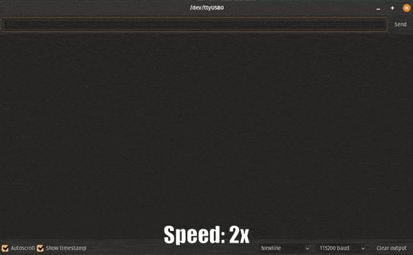

# 11th lesson: Multicore systems, and use of the 2nd core on the ESP32

Lesson: [https://www.youtube.com/watch?v=LPSHUcH5aQc&list=PLEBQazB0HUyQ4hAPU1cJED6t3DU0h34bz&index=12](https://www.youtube.com/watch?v=LPSHUcH5aQc&list=PLEBQazB0HUyQ4hAPU1cJED6t3DU0h34bz&index=12)

In this lesson, the task was to modify the 8th lesson's "project" and make its tasks run on different cores. Very few modifications were required in order to make it run properly.

In my case, I had an additional task running besides the CLI and average computing tasks, which handled the serial printing. I let that task run on any available core (tskNO_AFFINITY) instead of pinning it to a specific core. Whereas the **CLI task** was pinned to **core 1**, and the **AVG task** was pinned to **core 0**.

> Rrunning demo
