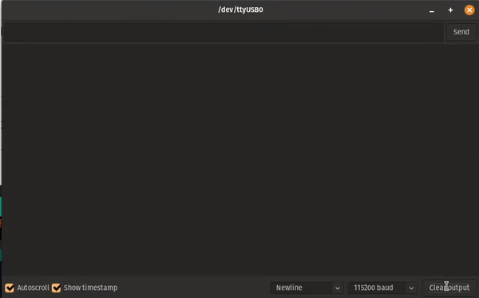
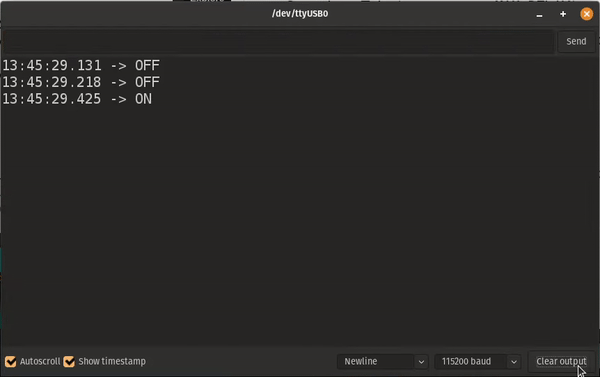

# 1st lesson: Blinking an LED with multiple tasks(threads)

Lesson: [https://www.youtube.com/watch?v=JIr7Xm_riRs](https://www.youtube.com/watch?v=JIr7Xm_riRs)

After creating what's propably one of the hardest blinking examples in the Arduino community, the task was to create a 2nd task that would interrupt the first blinking task's pattern of blinking the LED each *500ms* (as seen in the first GIF below, where I sent an "ON"/"OFF" string to report the LED's state).

I created the second task and made its blinking each *200ms* and as seen in the second GIF below, we successfully created a mess.

> First GIF: Normal blinking each 500ms

> Second GIF: Messy blinking

