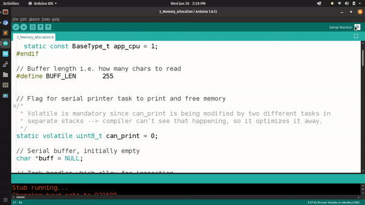

# 3rd lesson: Thread-safe memroy allocation and memory mapping in FreeRTOS

Lesson: [https://www.youtube.com/watch?v=Qske3yZRW5I](https://www.youtube.com/watch?v=Qske3yZRW5I)

In this lesson, the task was to create two tasks where one parses the data present in the serial port, allocate enough memory for it on the heap, and set a flag for the second task to print the content of the buffer and free the memory after finishign the task (--> no memory leaks).

This way we created an echo terminal.

> Running demo
