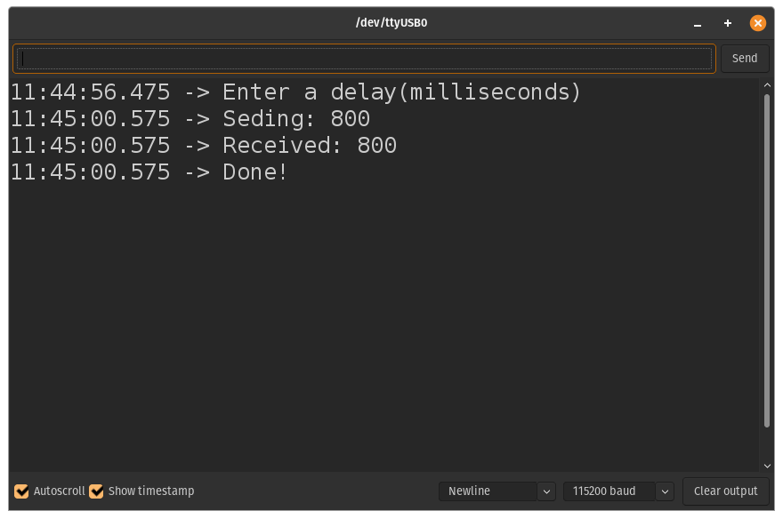

# 5th lesson: Use of **MUT**ual **EX**clusion (mutex) for critical sections' "protection" (race conditions with shared ressources)

Lesson: [https://www.youtube.com/watch?v=I55auRpbiTs&list=PLEBQazB0HUyQ4hAPU1cJED6t3DU0h34bz&index=6](https://www.youtube.com/watch?v=I55auRpbiTs&list=PLEBQazB0HUyQ4hAPU1cJED6t3DU0h34bz&index=6)

In this lesson, the task was to create a thread that would receive a local var from inside the setup thread (input by user) and using a mutex would guarantee its reception by the 2nd thread before the setup thread finishes and the local var is erased.

**Note**: It's very discouraged to pass in local stack variables between tasks, this application is a hack, and is only intended for learning purposes.

In the first picture, we didn't use mutexes and as a result, the setup task finished before the 2nd thread has copied the value of the var locally and as a result, the 2nd thread doesn't receive anything, whereas in the second picture, due to the use of a mutex, the setup thread only exits when we let it (give it back the mutex), hence we have the time to copy the value.

> First picture: no mutex used

> Second picture: mutex used
