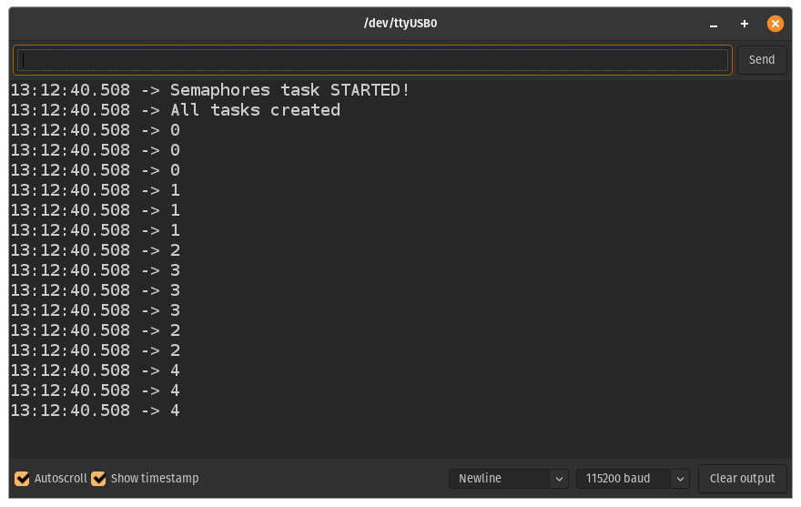

# 6th lesson: Use of Semaphores for shared ressources, by multiples threads, protection 

Lesson: [https://www.youtube.com/watch?v=5JcMtbA9QEE&list=PLEBQazB0HUyQ4hAPU1cJED6t3DU0h34bz&index=7](https://www.youtube.com/watch?v=5JcMtbA9QEE&list=PLEBQazB0HUyQ4hAPU1cJED6t3DU0h34bz&index=7)

The task in this lesson was to protect a circular buffer that's being *written to* by **5 threads** and *read from* by **2 threads** using both semaphores and mutexes (a mutex was used to protect the buffer and the serial port).

Each task was supposed to write its **ID** 3 times to the serial port. The results are shown in the picture down below.

> Results in serial port
