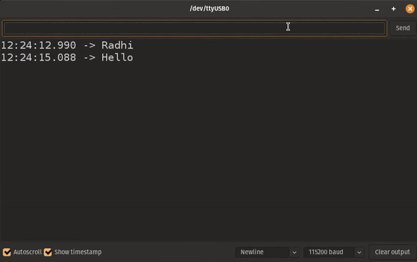

# 8th lesson: Hardware timers, interrupts, and a conclusive project

Lesson: [https://www.youtube.com/watch?v=qsflCf6ahXU&list=PLEBQazB0HUyQ4hAPU1cJED6t3DU0h34bz&index=12](https://www.youtube.com/watch?v=qsflCf6ahXU&list=PLEBQazB0HUyQ4hAPU1cJED6t3DU0h34bz&index=12)

In this lesson, the concepts of hardware interrupts were discussed and for a demo, the hardware timer was used to schedule tasks.

The task was to make the hardware timer rises an ISR to sample the ADC 10 times per second **10 Hz**, while a second task is echoing the serial input and looking for an "avg" command to be intered. Once the "avg" command is entered, this task shall return the most recent average of the last 10 measures. In fact, each 10 measures, the ISR signals (binary semaphore) to a **3rd** task to calculate the average of the last 10 measures and store it in a global variable.

A double buffer was created so that the ISR could keep on filling the samples while the **3rd** task is calculating the average.

> Running demo
