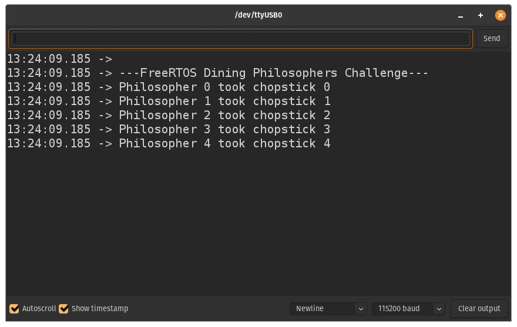

# 9th lesson: Deadlock, livelock, starvation, and the dining philosophers problem

Lesson: [https://www.youtube.com/watch?v=hRsWi4HIENc&list=PLEBQazB0HUyQ4hAPU1cJED6t3DU0h34bz&index=12](https://www.youtube.com/watch?v=hRsWi4HIENc&list=PLEBQazB0HUyQ4hAPU1cJED6t3DU0h34bz&index=12)

In this lesson, the concepts of deadlock, livelock, and starvation were discussed. I was presented with a script that has some delays here and there in order to enforce deadlock to happen, and the task was to implement a discussed solution. The script simulated the **dining philosophers**.

The first picture below presents how the script enters deadlock and never advances, whereas the second picture showcases the output of the script when deadlock doesn't occurr.

> First image: Deadlock

> Second image: No deadlock
